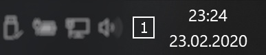

# Virtual Desktop Indicator

Virtual desktop indicator for system tray with light and dark theme and HiDPI support.

## Screenshot

*Dark theme screenshot*

## Install

Download the latest release from [VirtualDesktopIndicator releases on GitHub](https://github.com/0gdump/windows-virtualdesktopindicator/releases "VirtualDesktopIndicator on GitHub") and run it.

## Special thanks

Special thanks to the user [Flaflo](https://github.com/Flaflo) for improving compatibility with Windows 10 1809+.

## License

The app is distributed under [MIT License](https://github.com/0gdump/windows-virtualdesktopindicator/blob/master/LICENSE).